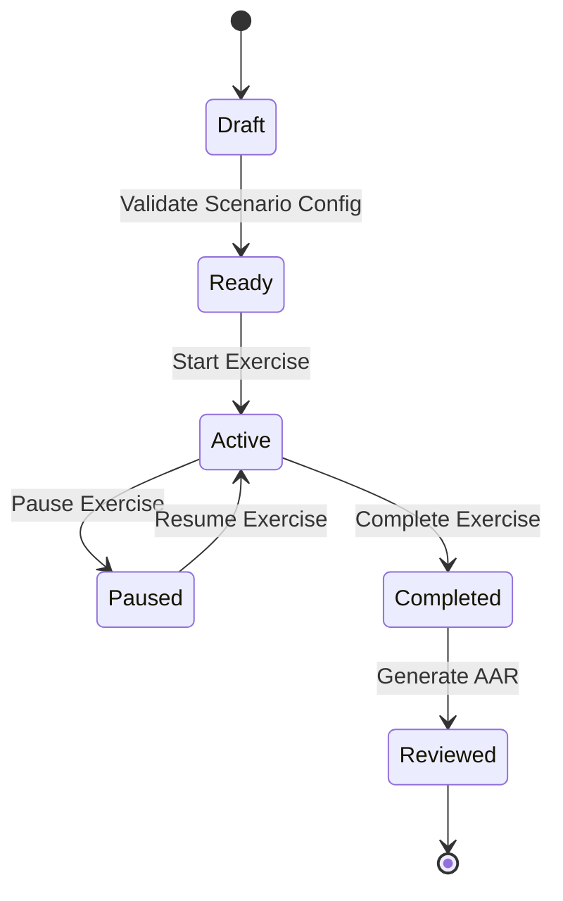

# OPERATIONAL FOG — Backend Architecture & Database Documentation

## 1. Technical Stack Overview

| Component | Technology | Version / Container Image | Role |
| :--- | :--- | :--- | :--- |
| **Frontend UI** | React 19 + Vite 8 | `node:20-alpine` | User interface, instructor dashboard, real-time participant console |
| **Backend API** | Node.js + Express | `node:20-alpine` | Authoritative simulation engine, REST API, state machine, lifecycle controller |
| **Database** | PostgreSQL | `postgres:16-alpine` | Persistent relational storage for scenarios, exercises, events, decisions, and AARs |
| **Orchestration** | Docker Compose | Specification 3.8 | Container management, internal DNS networking, persistent volume bindings |

---

## 2. Docker Architecture & Networking

```
+-------------------------------------------------------------------------------+
|                             Docker Host Network                               |
|                                                                               |
|  +--------------------+   http://localhost:4000    +-------------------+      |
|  | Frontend Container | -------------------------> | Backend Container |      |
|  | (Vite Port 5173)   | <------------------------- | (Express Port 4000|      |
|  +--------------------+    REST API / WebSocket    +-------------------+      |
|            |                                                 |                |
|            |                Docker App Network               |                |
|            +------------------ (Bridge) ---------------------+                |
|                                                              |                |
|                                                     postgres://db:5432        |
|                                                              v                |
|                                                    +-------------------+      |
|                                                    | Database Container|      |
|                                                    | (PostgreSQL 16)   |      |
|                                                    +-------------------+      |
|                                                              |                |
|                                                   +----------------------+    |
|                                                   | Volume: postgres_data|    |
|                                                   +----------------------+    |
+-------------------------------------------------------------------------------+
```

### Docker Services Configuration
1. **`db` Service**:
   - Image: `postgres:16-alpine`
   - Internal Docker Hostname: `db`
   - Port Mapping: `127.0.0.1:5432:5432` (restricted to localhost for host developer debugging; internal container traffic uses port 5432 on internal network).
   - Storage: Persistent named Docker volume `postgres_data` mapped to `/var/lib/postgresql/data`.
   - Health Check: `pg_isready -U postgres -d operational_fog` (interval 5s, timeout 5s, retries 5).

2. **`backend` Service**:
   - Image: Built from `./backend/Dockerfile`
   - Ports: `4000:4000`
   - Environment: `DATABASE_URL=postgres://postgres:postgres_secure_pass@db:5432/operational_fog`
   - Container Dependency: Waits for `db` service healthcheck (`service_healthy`) before launching server and executing migrations.

3. **`frontend` Service**:
   - Image: Built from `./Dockerfile`
   - Ports: `5173:5173`
   - Environment: `VITE_API_URL=http://localhost:4000/api`

---

## 3. Database Relational Schema

The database schema is defined in [`backend/db/schema.sql`](file:///c:/Users/Yamini/OPERATIONAL-FOG/backend/db/schema.sql) and managed by automated idempotent migration runner [`backend/db/migrate.js`](file:///c:/Users/Yamini/OPERATIONAL-FOG/backend/db/migrate.js).

### Primary Entities

```mermaid
erDiagram
    USERS ||--o{ SCENARIOS : creates
    USERS ||--o{ EXERCISES : owns
    SCENARIOS ||--o{ EXERCISES : instantiates
    EXERCISES ||--o{ EXERCISE_PARTICIPANTS : includes
    EXERCISES ||--o{ COMMUNICATION_EVENTS : logs
    EXERCISES ||--o{ PARTICIPANT_DECISIONS : records
    EXERCISES ||--o| AARS : generates
    USERS ||--o{ PARTICIPANT_DECISIONS : submits

    USERS {
        uuid id PK
        string email UK
        string password_hash
        string display_name
        string role
        string status
        timestamp created_at
    }

    SCENARIOS {
        uuid id PK
        string title
        text description
        jsonb objectives
        jsonb config
        jsonb events
        int version
        uuid creator_id FK
        boolean is_archived
        timestamp created_at
    }

    EXERCISES {
        uuid id PK
        uuid scenario_id FK
        string scenario_title
        jsonb scenario_snapshot
        uuid instructor_id FK
        string session_code UK
        string status
        timestamp start_time
        timestamp pause_time
        timestamp resume_time
        timestamp completed_time
    }

    COMMUNICATION_EVENTS {
        uuid id PK
        uuid exercise_id FK
        string title
        text content
        string sender_role
        string recipient_role
        string event_type
        string delivery_behavior
        int delivery_delay_sec
        int simulated_time_sec
        string delivery_status
        timestamp actual_delivery_time
    }

    PARTICIPANT_DECISIONS {
        uuid id PK
        uuid exercise_id FK
        uuid participant_id FK
        string participant_name
        string role
        text decision_text
        text rationale
        int simulated_time_sec
        timestamp timestamp
    }

    AARS {
        uuid id PK
        uuid exercise_id FK UK
        string title
        int total_events
        int delivered_events
        int delayed_events
        int dropped_events
        int decisions_count
        text instructor_notes
        timestamp generated_at
    }
```

---

## 4. Authoritative Communication Simulation Engine

The simulation engine ([`backend/services/simulationEngine.js`](file:///c:/Users/Yamini/OPERATIONAL-FOG/backend/services/simulationEngine.js)) is the single source of truth for exercise message evaluation and recipient visibility.

### Delivery Behaviors & Rules

1. **Normal Delivery (`normal`)**:
   - Delivered to matching recipient role immediately when simulated time reaches event schedule timestamp `T <= T_sim`.
   - Marked as `delivered`.

2. **Delayed Delivery (`delayed`)**:
   - Delayed by `delivery_delay_sec`.
   - Invisible to recipient while `T_sim < (simulated_time_sec + delivery_delay_sec)`.
   - Marked as `pending_delay` until delivery threshold is met, then transitions to `delivered`.

3. **Dropped Dispatch (`dropped`)**:
   - Simulates complete signal blackout or electronic interference.
   - Permanently excluded from participant feeds (`delivery_status = 'dropped'`).
   - Recorded in full within the Instructor Control Log for post-exercise evaluation.

4. **Conflicting Reports (`conflicting`)**:
   - Delivers contradictory information to different recipient roles (e.g., conflicting field reconnaissance feeds).
   - Provenance and sender tags are preserved intact for discrepancy analysis.

5. **Incomplete Reports (`incomplete`)**:
   - Delivers truncated dispatches marked explicitly with `is_truncated: true` and missing metadata flags.

### Recipient-Specific Visibility Filtering
When a participant requests their message feed (`GET /api/exercises/:id/messages?role=...`), the server enforces strict role isolation:
- Messages targeted to `"All"` are visible to all exercise participants.
- Messages targeted to specific roles (e.g., `"HQ"`, `"Field Unit"`, `"Logistics"`) are visible **only** to authorized users assigned to that role.
- Instructor requests (`GET /api/exercises/:id/instructor-log`) bypass recipient filtering to view all events including dropped and delayed items.

---

## 5. Exercise Lifecycle State Machine

Valid lifecycle states and allowed transitions:



### Transition Enforcement Rules
- **Scenario Validation**: An exercise cannot transition to `Ready` or `Active` unless the parent scenario contains valid objective definitions and event schedules.
- **Scenario Immutability Snapshot**: When an exercise is launched (`Active`), an immutable JSON snapshot of the scenario configuration is written to `exercises.scenario_snapshot`. Subsequent edits to the source scenario **never** alter active or historical exercises.
- **Completion Lock**: Once an exercise reaches `Completed` state, no further communication events, decision submissions, or state changes can occur.

---

## 6. Authentication & Authorization Model

- **Service Authentication**: API endpoints validate authorization headers (`Authorization: Bearer <token>` or `X-User-Role: Instructor`).
- **Role Isolation**:
  - `Instructor`: Can create/edit scenarios, launch exercises, pause/resume/complete sessions, view full instructor control logs, write AAR observations.
  - `Participant`: Can join exercises via Join Code, retrieve role-specific delivered messages, and submit decisions. Cannot access other participants' draft decisions or full instructor logs.

---

## 7. After-Action Review (AAR) System

AAR records are generated directly from actual persisted database event logs and participant decision records.

### Reconstructed Audit Metrics
- **Configuration Snapshot**: Reconstructs exact rules used at launch.
- **Delivery Metrics**: Counts of total dispatches, delivered items, delayed items, dropped items, and conflicting reports.
- **Participant Timeline**: Correlates exact information available to a participant at the exact moment their decision was submitted.
- **Reproducibility**: Historical AAR records are immutable and survive server/container restarts.

---

## 8. API Endpoint Reference

| Method | Endpoint | Description | Auth Required |
| :--- | :--- | :--- | :--- |
| `GET` | `/api/health` | Service & DB connectivity check | None |
| `GET` | `/api/scenarios` | List active scenarios | User |
| `POST` | `/api/scenarios` | Create custom scenario | Instructor |
| `GET` | `/api/exercises` | List exercises / sessions | User |
| `POST` | `/api/exercises` | Create exercise session | Instructor |
| `PUT` | `/api/exercises/:id/status` | Update exercise lifecycle state | Instructor |
| `GET` | `/api/exercises/:id/messages` | Get recipient-filtered message feed | Participant / Instructor |
| `GET` | `/api/exercises/:id/instructor-log` | Get full authoritative event history | Instructor |
| `POST` | `/api/exercises/:id/decisions` | Submit participant decision | Participant |
| `GET` | `/api/aars` | List completed AAR reports | User |
| `POST` | `/api/aars` | Generate or update AAR report | Instructor |

---

## 9. Developer Commands & Workflows

### First-Time Setup
```bash
docker compose up --build
```

### Run Migrations Explicitly
```bash
docker compose exec backend node db/migrate.js
```

### Run Automated Unit & Integration Tests
```bash
npm test
```

### Clean Shutdown (Preserves Database Data)
```bash
docker compose down
```

---

## 10. Verification & Known Limitations

- **Dual-Mode Persistence**: The frontend `storageService.js` automatically falls back to in-memory/LocalStorage persistence if the backend API container is offline, ensuring uninterrupted UI testing.
- **Single-Node Deployment**: Redis is omitted from initial infrastructure to avoid unnecessary operational complexity; PostgreSQL native indexing and transactional locks handle concurrency safely.
